# 🚀 Hotel Management System
> A backend application demonstrating Object-Relational Mapping (ORM) concepts by building a custom ORM from scratch in TypeScript/Nest.js ,for a comprehensive Hotel Management System. This project handles user authentication, multi-role management (Clients/Employees), room inventory, and complex booking/payment flows.


---

## ⚡ Features

* **Multi-Role Authentication:** Support for `CLIENT`, `EMPLOYEE`, and `ADMIN`.
* **Dynamic Room Management:** Flexible room types (Single, Double, Suite) and real-time status tracking.
* **Reservation Lifecycle:** Full booking workflow from `PENDING` to `COMPLETED`.
* **Financial Tracking:** Integrated payment records and automatic invoice generation.
* **Role-Based Access:** Validations linked to specific employees for accountability.

## 🛠 Tech Stack

* **Database:** PostgreSQL (Compatible with MySQL/SQLite)
* **Backend:**  TypeScript/nest.js
* **Frontend:** React


## 🗄 Database Design

```mermaid
graph LR
    subgraph Actors
        C[Client]
        E[Employé]
        A[Admin]
    end

    subgraph "Système de Gestion Hôtelière"
        %% Client Features
        UC1(Gestion de compte client)
        UC1_a(Cree compte)
        UC1_b(Se connecter)
        UC2(Gestion des réservations)
        UC3(Effectuer un paiement)
        UC4(Consulter ses factures)
        
        %% Employee Features
        UC5(Gestion des réservations)
        UC5_a(Confirmer / refuser)
        UC5_b(Consulter)
        UC6(Gestion des factures)
        UC7(Gérer l'état des chambres)
        UC10(Effecter Paiement)
        
        %% Admin Features
        UC8(Gestion des comptes employés)
        UC9(Paramétrer le système)
        UC9_a(Définir les chambres)
        UC9_b(Définir les tarifs)

        %% Internal Relationships
        UC1 -.->|include| UC1_a
        UC1_b -.->|extends| UC1

      
        
        UC5 -.->|include| UC5_a
        UC5 -.->|include| UC5_b
        
        UC5_a -.->|extends| UC7
        
        UC9 -.->|include| UC9_a
        UC9 -.->|include| UC9_b
    end

    %% Actor Connections
    C --> UC1
    C --> UC2
    C --> UC3
    C --> UC4

    E --> UC5
    E --> UC6
    E --> UC7
    E -->UC10

    A --> UC8
    A --> UC9

```





## 📁 Project Structure


 ```bash
├── Frontend/
├── prisma/
│   └── schema.Prisma
    └── schema.prisma
├── src/
│   ├── controllers/
│   ├── services/
│   ├── routes/
│   ├── auth/
│   ├── clients/
│   ├── employees/
│   ├── invoices/
|   |── payments/
│   |── revérvation/
│   |── room-types/
│   |── room/
│   |── scripts/
│   |── users/
│   └── main.ts
├── .env

├── package.json
└── README.md


```

## 🧠 Theoretical Background

##  Object-Relational Mapping (ORM)
 **What is an ORM?**

**ORM**  (Object-Relational Mapping) is a programming technique that facilitates interaction between an object-oriented programming language and a relational database.

Instead of writing raw SQL queries, ORM allows developers to interact with the database using objects, classes, and methods that are native to the programming language.
The ORM automatically translates these operations into database-specific queries.

This abstraction reduces complexity and improves developer productivity while preserving data consistency.

## 🎭 What Happens Behind the Scenes

** Query generation**

Instead of manually writing a SQL query such as:
```sql
SELECT * FROM users WHERE age > 18;
```

The developer writes a more intuitive, object-oriented instruction, for example:
```md
User.objects.filter(age > 18)
```
The ORM translates this instruction into the appropriate SQL (or database-specific) query automatically.

## Execution
Once the query is generated, the ORM:

* Manages the database connection

* Sends the query to the database

* Handles execution and error management

This removes the need for developers to manually manage low-level database operations.

##  Mapping: From Database Results to Objects

After execution, the database returns results in a tabular format (rows and columns).
The ORM maps these results back into application-level objects, allowing developers to work with structured data instead of raw rows.

This process is known as object **mapping**.

##  Relationship Management
ORMs understand and manage relationships between entities, such as:

**One-to-One**

**One-to-Many**

**Many-to-Many**

For example, when retrieving a user and their related posts, the ORM automatically generates the required JOIN operations and returns the associated objects without the developer writing complex SQL joins manually.


##  Caching
To improve performance, many ORMs implement caching mechanisms.
Frequently accessed data can be temporarily stored in memory, reducing repeated database queries and improving response time.


## Indexing Strategy & Performance

Indexes are used to optimize frequent queries and enforce constraints.

### Why indexing matters
In relational databases, searching without indexes leads to full table scans,
which become expensive as data grows.

### Indexing decisions in this project

- `User.role`
  - Used frequently for role-based access control
  - Indexed to speed up authorization checks

- `Reservation(statut)`
  - Allows fast filtering of reservations (PENDING, CONFIRMED, COMPLETED)

- `Reservation(date_debut, date_fin)`
  - Optimizes availability checks for rooms over date ranges

- Foreign Keys (`id_user`, `id_client`, `validated_by`)
  - Improve JOIN performance between related entities

### Trade-offs
Indexes improve read performance but slightly slow down writes.
This trade-off is acceptable since hotel systems are read-heavy.

### ⚠️ N+1 Query Problem

One common ORM performance issue is the N+1 query problem,
where fetching related entities results in multiple unnecessary queries.

